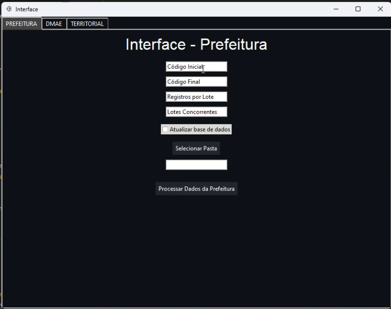
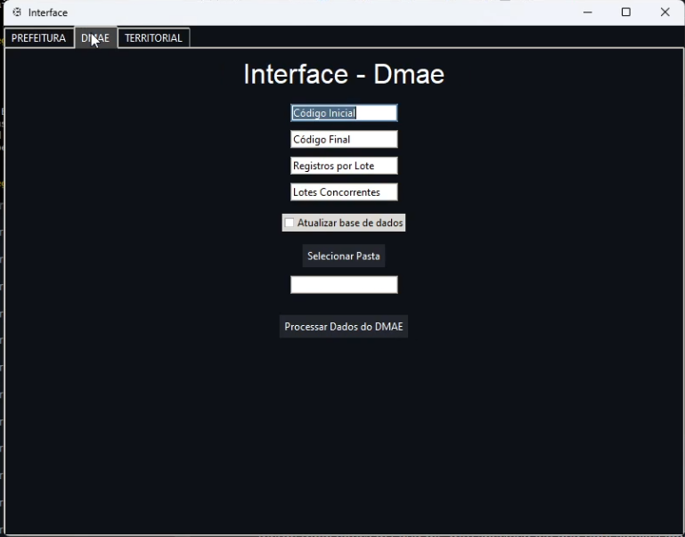
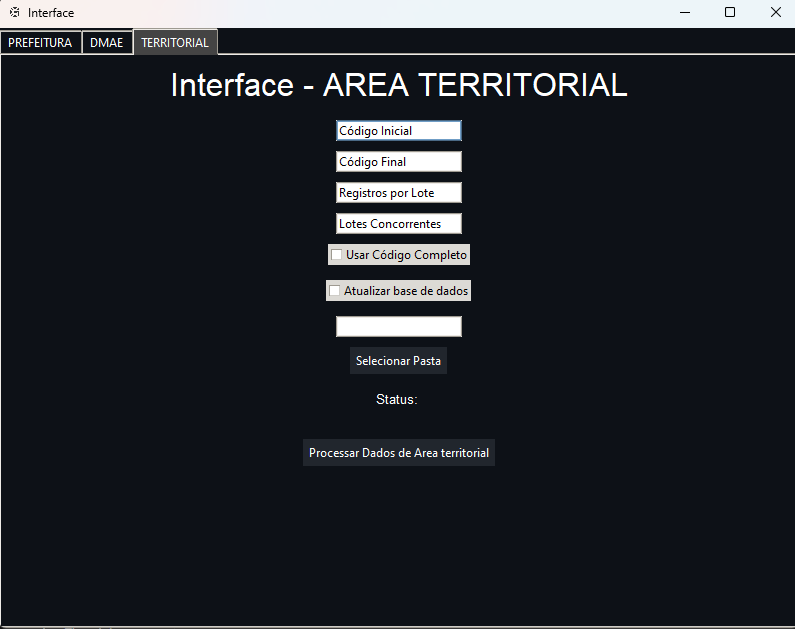

# Interface de Processamento de Dados

Este projeto consiste em uma interface gráfica desenvolvida para fazer scrapping de informações imobiliárias de Uberlândia.

## Funcionalidades

A interface possui três abas distintas:

1. **Prefeitura**
2. **DMAE**
3. **Área Territorial**

### Campos Comuns

- **Código Inicial:** Entrada para o código inicial de busca de dados.
- **Código Final:** Entrada para o código final de busca de dados.
- **Registros por Lote:** Entrada para o número de registros por lote.
- **Lotes Concorrentes:** Entrada para o número de lotes concorrentes.
- **Atualizar base de dados (checkbox):** Checkbox para ativar a atualização da base de dados.
- **Selecionar Pasta:** Botão para selecionar o diretório onde o CSV será salvo.
- **Processar Dados (botão):** Botão para iniciar o processamento dos dados.

### Campos Específicos

- **Usar Código Completo (checkbox):** Checkbox para ativar a busca por código completo.
- **Parte a ser Mudada:** Entrada para a parte a ser mudada do código completo (visível apenas quando "Usar Código Completo" está ativado).

### Funcionamento dos Campos

#### Código Inicial e Código Final

##### Quando "Usar Código Completo" está desativado:

- **Código Inicial:** Deve ser um valor inteiro simples representando o início do intervalo de códigos a serem processados.
- **Código Final:** Deve ser um valor inteiro simples representando o fim do intervalo. A busca será feita para códigos no intervalo start_code + i para i em range(end_code).

##### Quando "Usar Código Completo" está ativado:

- **Código Inicial:** Deve ser um código completo no formato, por exemplo, '00 03 0102 15 10 0001 0009'.
- **Código Final:** Deve ser um valor inteiro que será usado para gerar um intervalo de códigos, mudando a parte especificada no código completo inicial. Por exemplo, se o Código Inicial é '00 03 0102 15 10 0001 0009', a Parte a ser Mudada é 1, e Código Final é 10, os códigos gerados serão ['00030102151000010009', '00030102151000010010', '00030102151000010011', ..., '00030102151000010018'].

### Abas da Interface

#### Prefeitura

Campos:
- Código Inicial
- Código Final
- Registros por Lote
- Lotes Concorrentes
- Atualizar base de dados (checkbox)
- Selecionar Pasta
- Processar Dados da Prefeitura (botão)

Formato do CSV gerado:
```
codigo,endereco,codigo_completo,codigo_reduzido
10101010200160000,"RUA URANO, 13",IMO: 00.01.0101.01.02.0016.0000,61
```



#### DMAE

Campos:
- Código Inicial
- Código Final
- Registros por Lote
- Lotes Concorrentes
- Atualizar base de dados (checkbox)
- Selecionar Pasta
- Processar Dados do DMAE (botão)

Formato do CSV gerado:
```
Cod_Reduzido,Insc_Cadastral,Imovel_Endereco,Bairro,Quadra,Lote,Area Territorial,Area Predial,Testada,Cod_Prefeitura,Contribuinte_CPF,Contribuinte_Nome,Contribuinte_Endereco,Contribuinte_CEP,Bairro_Contribuinte
187,00 01 0101 01 07 0002 0002,"AVENIDA CONSTELACAO, 52 - FUNDOS",PRESIDENTE ROOSEVELT,116B,0017,0,0,0,297342,600.079.901-20,ELIANA ROSA DA SILVA,"AVENIDA CONSTELACAO, 52",38.401-127,PRESIDENTE ROOSEVELT - UBERLANDIA/MG
```



#### Área Territorial

Campos:
- Código Inicial
- Código Final
- Registros por Lote
- Lotes Concorrentes
- Atualizar base de dados (checkbox)
- Selecionar Pasta
- Processar Dados da Área Territorial (botão)

Formato do CSV gerado:
```
Cod_Reduzido,Insc_Cadastral,Imovel_Endereco,Bairro,Quadra,Lote,AreaTerritorial,AreaPredial,Testada_y,Cod_Prefeitura,Contribuinte_CPF,Contribuinte_Nome,Contribuinte_Endereco,Contribuinte_CEP,Bairro_Contribuinte,CEPImovel
15,00 01 0101 01 01 0005 0004,"RUA ESTRELA DALVA, 254",JARDIM BRASILIA,0064,0005,"4,477375","32,340000","12,000000",152669,159.899.926-53,DEVANIDES DE OLIVEIRA,"RUA URANO, 100",38.401-372,JARDIM BRASILIA - UBERLANDIA/MG,38401372.0
```



## Como Usar

1. Selecione a aba desejada (Prefeitura, DMAE, Área Territorial).
2. Preencha os campos obrigatórios conforme a descrição.
3. (Opcional) Ative as opções adicionais como "Atualizar base de dados" ou "Usar Código Completo".
4. Clique em "Selecionar Pasta" para escolher onde o arquivo CSV será salvo.
5. Clique em "Processar Dados" para iniciar o processamento e geração do arquivo CSV.

## Requisitos

- Python 3.x
- Bibliotecas necessárias (disponíveis no `requirements.txt`)

## Instalação
1. Clone do git
```sh
git clone https://github.com/Arthur020104/ScrappingImoveis.git
```
2. Altere para a pasta do arquivo
```sh
cd ./ScrappingImoveis
```
3. Instale as libs necessárias
```sh
pip install -r requirements.txt
```
4. Rode o arquivo de setup
```sh
python setup.py
```
